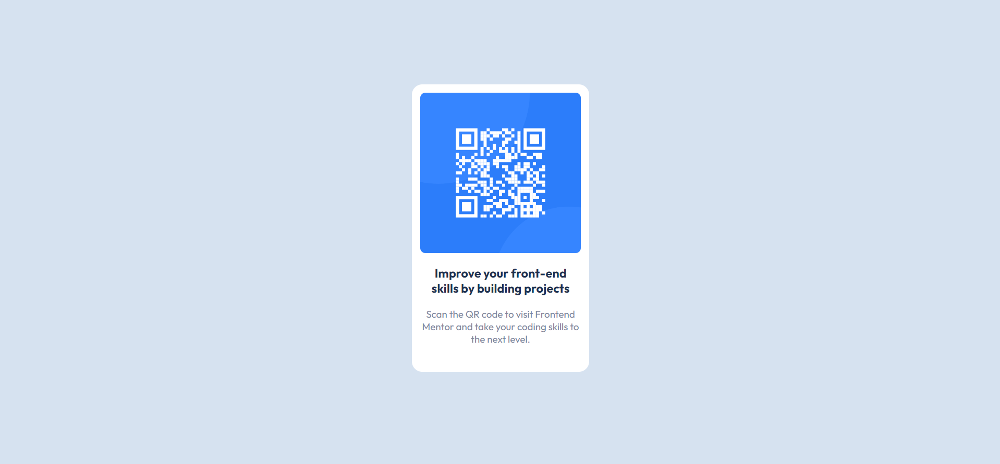

# Frontend Mentor - QR code component solution

This is a solution to the [QR code component challenge on Frontend Mentor](https://www.frontendmentor.io/challenges/qr-code-component-iux_sIO_H). Frontend Mentor challenges help you improve your coding skills by building realistic projects. 

## Table of contents

- [Overview](#overview)
  - [Screenshot](#screenshot)
  - [Links](#links)
- [My process](#my-process)
  - [Built with](#built-with)
  - [What I learned](#what-i-learned)
- [Author](#author)

## Overview

A QR Code component created using HTML5 and CSS3.

### Screenshot



### Links

- Solution URL: [Solution URL](https://github.com/AmanHarsh02/qr-code-component-frontend-mentor)
- Live Site URL: [Live Site URL](https://qr-code-component-aman.netlify.app/)

## My process

### Built with

- Semantic HTML5 markup
- CSS custom properties
- Flexbox
- Web-first workflow

**Note: These are just examples. Delete this note and replace the list above with your own choices**

### What I learned

- How to vertically centre the elements.

```css
body {
    font-family: 'Outfit', sans-serif;
    background-color: var(--light-gray);
    height: 96vh;
    display: flex;
    align-items: center;
    justify-content: center;
}
```

## Author

- Website - [Aman Harsh](https://amanharsh.netlify.app/)
- Frontend Mentor - [@AmanHarsh02](https://www.frontendmentor.io/profile/AmanHarsh02)
- Twitter - [@amanharsh0203](https://twitter.com/amanharsh0203)
